# Salary Dataset - Exploratory Data Analysis (EDA)

## Introduction

This project explores salary trends using **Exploratory Data Analysis (EDA)**. The goal is to uncover insights into salary distributions, job roles, industries, and company factors that influence compensation. Through **19 high-quality visualizations**, we analyze the relationship between job roles, employment status, company ratings, and salary trends.

## 📂 Dataset Overview

The dataset contains structured salary information across various job roles, employment types, industries, and locations. The analysis focuses on:

- **Salary Distribution:** Understanding how salaries are spread across different roles.
- **Employment Status Impact:** How full-time, part-time, and contract jobs affect salary levels.
- **Industry Trends:** Identifying the most lucrative industries.
- **Job Role Analysis:** Examining salary differences across roles.
- **Company Ratings Influence:** Analyzing the correlation between salary and company reputation.

### 📌 Libraries & Dependencies
To successfully run the project and generate the visualizations, ensure you have the following Python libraries installed:

```bash
pip install pandas matplotlib seaborn folium wordcloud numpy
```

## 📊 Exploratory Data Analysis

### 1️⃣ Salary Distribution – Histogram & KDE Plot
This visualization represents the overall salary distribution in the dataset, highlighting salary concentration and outliers.

<p align="center">
  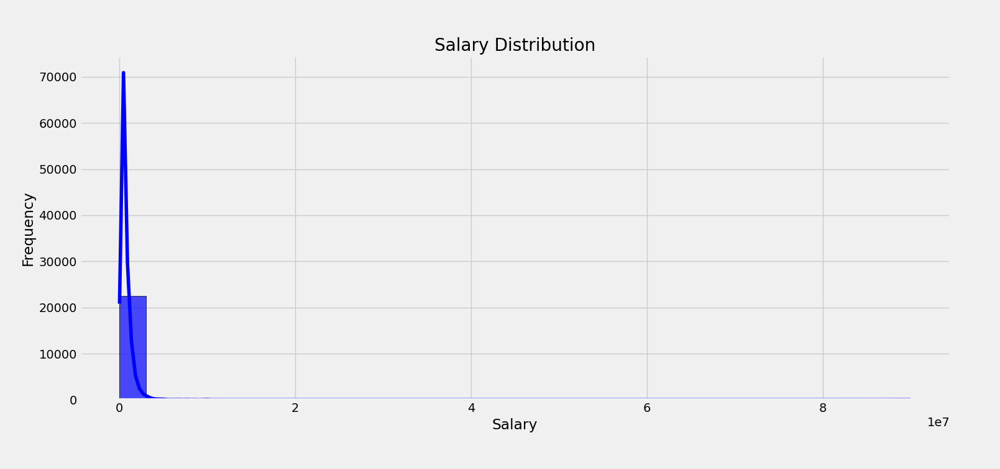
</p>

---

### 2️⃣ Salary Density Plot
A Kernel Density Estimate (KDE) plot illustrating the probability density of different salary ranges.

<p align="center">
  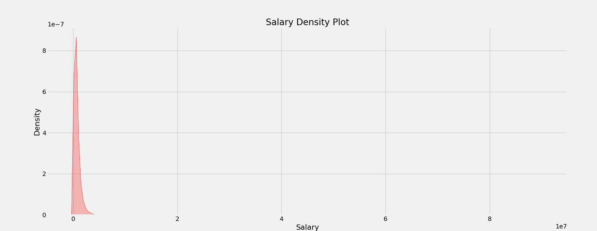
</p>

---

### 3️⃣ Salary Distribution by Employment Status
Compares salaries based on employment type (Full-time, Part-time, Contract).

<p align="center">
  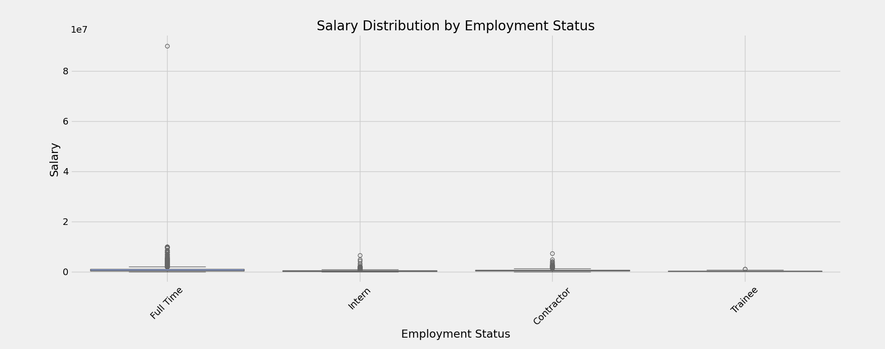
</p>

---

### 4️⃣ Salary Distribution Across Job Roles
Visualizes the variation in salaries across different job titles.

<p align="center">
  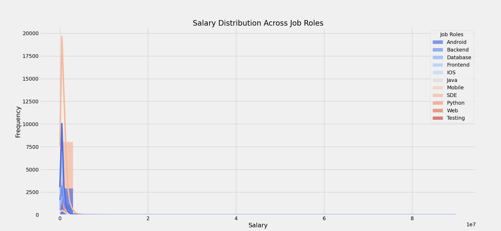
</p>

---

### 5️⃣ Most Popular Job Titles
Displays the most frequently occurring job titles in the dataset.

<p align="center">
  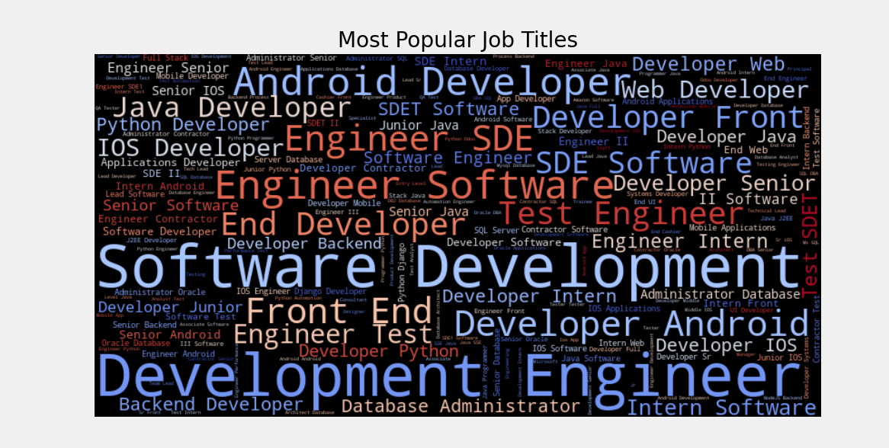
</p>

---

### 6️⃣ Most Common Job Roles
A bar chart showcasing the most common job roles in the dataset.

<p align="center">
  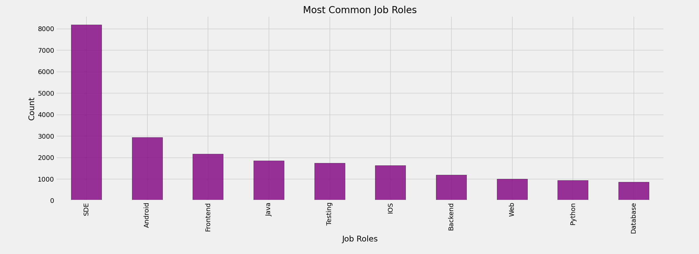
</p>

---

### 7️⃣ Top 10 Locations with Highest Salaries
Identifies the locations offering the highest average salaries.

<p align="center">
  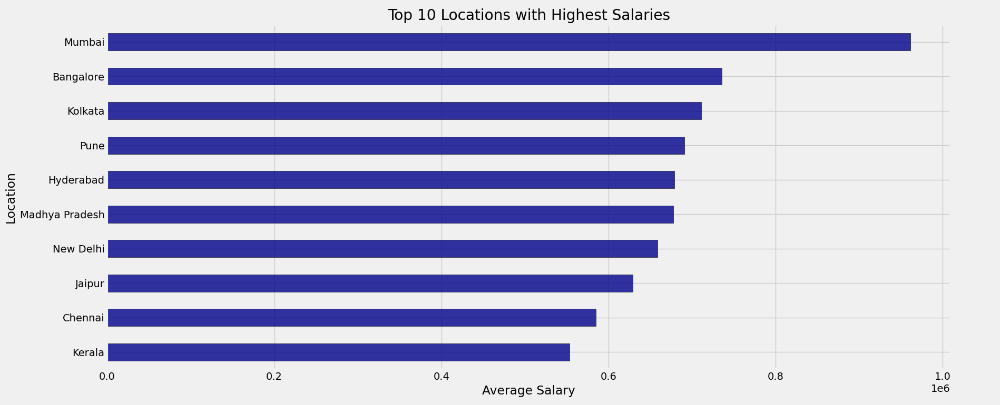
</p>

---

### 8️⃣ Top Companies Paying the Highest Salaries
Highlights the companies offering the best compensation.

<p align="center">
  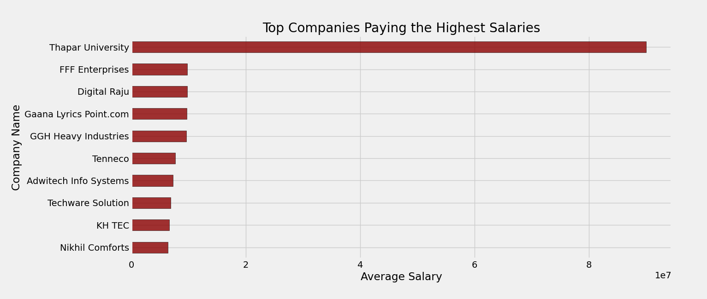
</p>

---

### 9️⃣ Salary Breakdown by Job Roles & Employment Status
Illustrates how different job roles and employment statuses impact salary ranges.

<p align="center">
  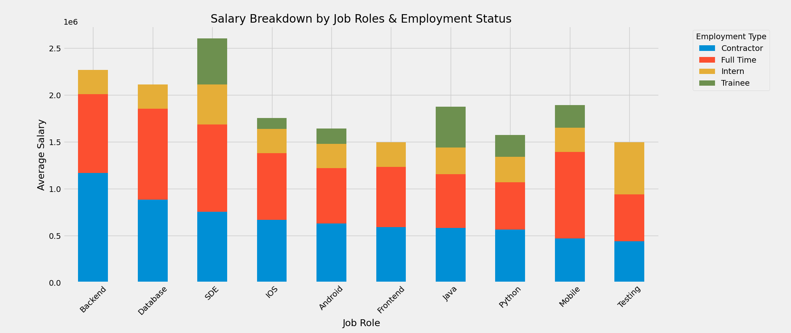
</p>

---

### 🔟 Salary Trends Over Job Roles
A trend analysis of how salaries fluctuate across various job positions over time.

<p align="center">
  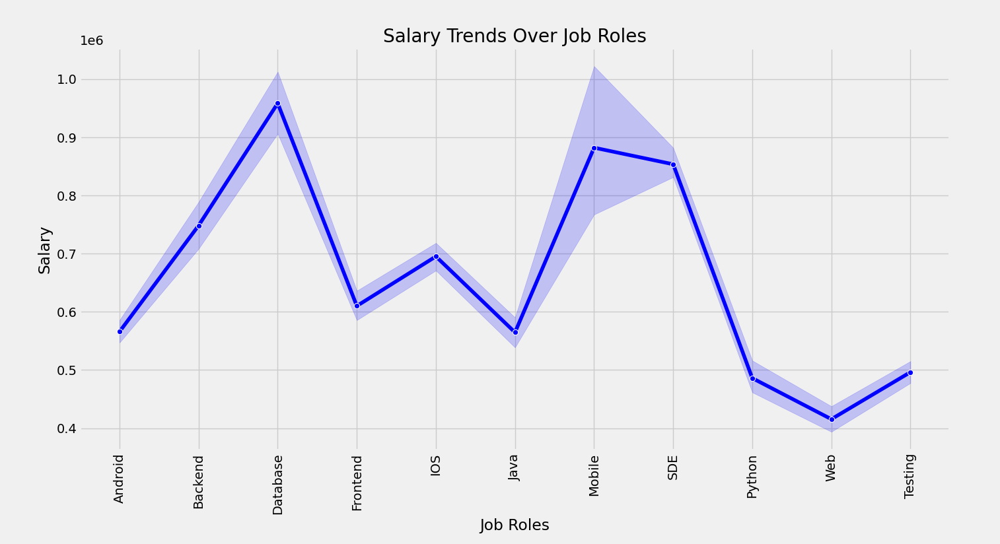
</p>

---

### 1️⃣1️⃣ Salary Trends per Industry
Examines how different industries pay over time.

<p align="center">
  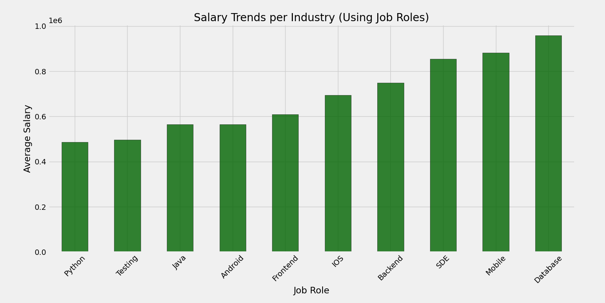
</p>

---

### 1️⃣2️⃣ Salary Variance by Employment Type
Shows how salary varies across different employment types.

<p align="center">
  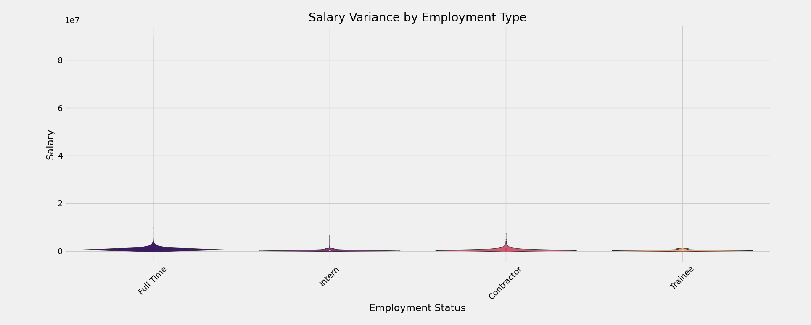
</p>

---

### 1️⃣3️⃣ Salary Variance by Job Roles & Employment Status
Explores the variance in salaries when considering both job roles and employment status.

<p align="center">
  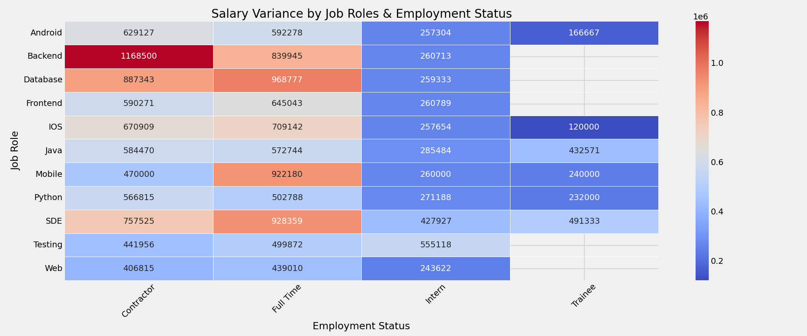
</p>

---

### 1️⃣4️⃣ Salary vs. Company Rating
Analyzes whether higher-rated companies offer better salaries.

<p align="center">
  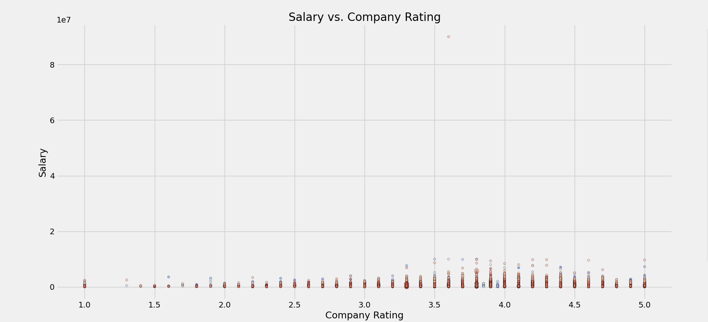
</p>

---

### 1️⃣5️⃣ Salary Outlier Analysis
Detects anomalies in salary distribution, identifying potential data issues or extreme values.

<p align="center">
  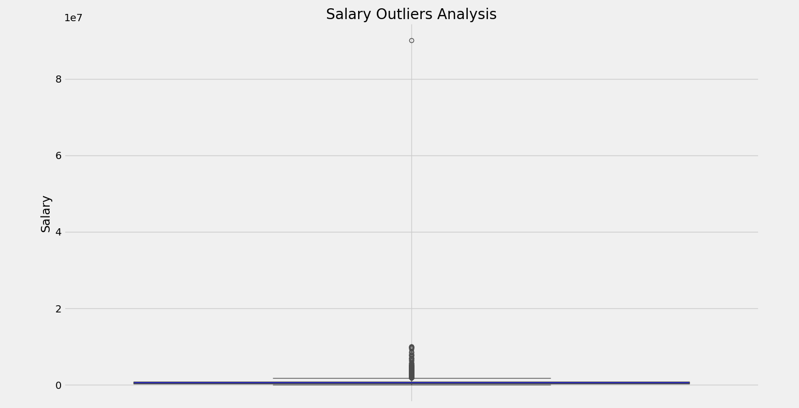
</p>

---

### 1️⃣6️⃣ Salary Trends Per Job Role & Employment Type
Visualizes how salary trends shift based on job role and employment type.

<p align="center">
  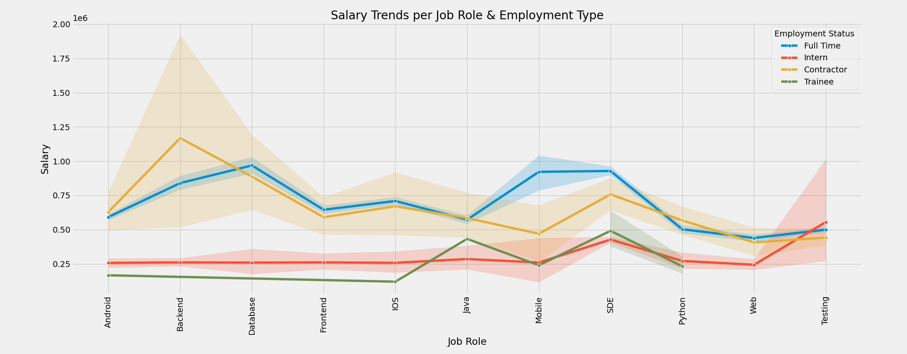
</p>

---

### 1️⃣7️⃣ Correlation Heatmap of Salary Dataset
A correlation matrix heatmap showcasing relationships between salary and other features.

<p align="center">
  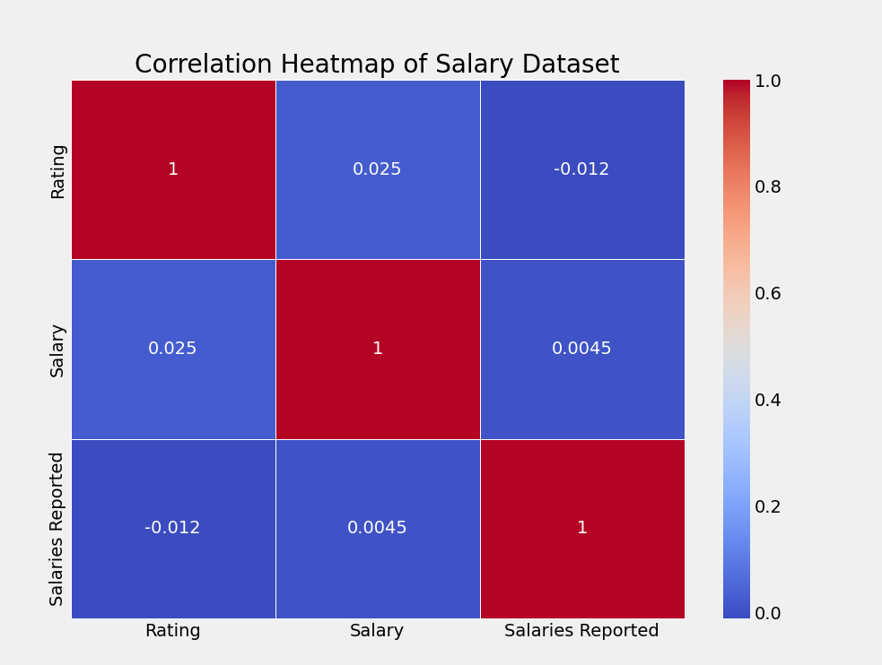
</p>

---

### 1️⃣8️⃣ Salary Distribution by Job Role
Examines the salary spread for different job roles.


<p align="center">
  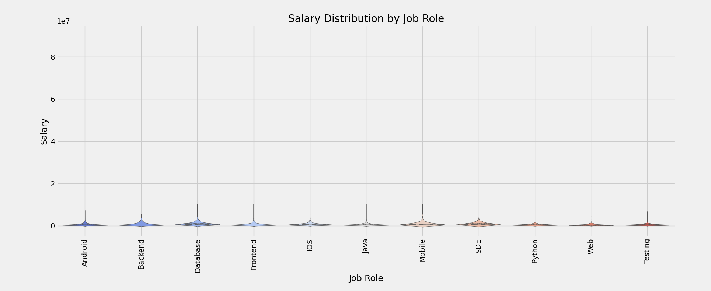
</p>

---

### 1️⃣9️⃣ Top Job Roles Salaries
Shows the highest-paying job roles in the dataset.


<p align="center">
  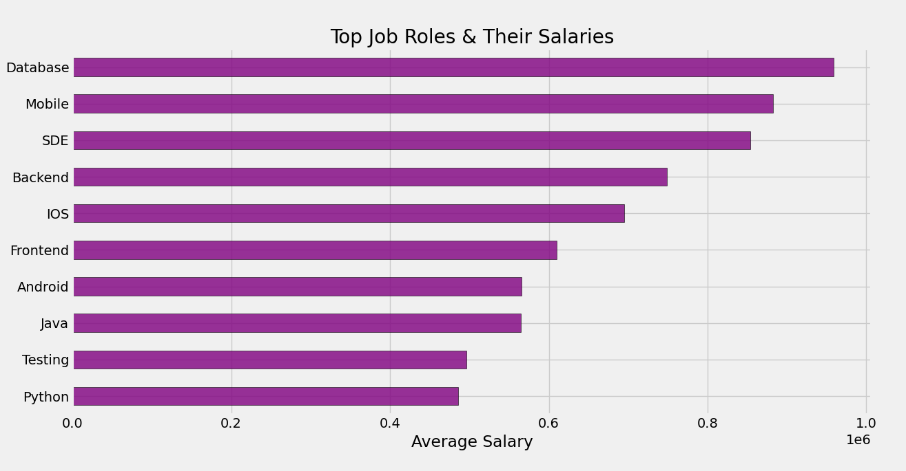
</p>

---

## 🔎 Key Insights
- Salaries significantly vary based on **employment type**, with full-time roles offering the highest pay.
- **Top-paying companies** have higher **company ratings**, indicating a correlation between job satisfaction and salary.
- The **technology and finance sectors** offer the most competitive salaries.
- Salary outliers exist, highlighting potential **highly paid executive roles** or **data inconsistencies**.

---

## 📊 Interactive Salary Insights Dashboard

Explore the interactive **Salary Insights Dashboard** created using **Tableau** to gain deeper insights into salary distributions, job roles, industries, and company factors influencing compensation.

<div class='tableauPlaceholder' id='viz1739394395225' style='position: relative'>
    <noscript>
        <a href='#'>
            
        </a>
    </noscript>
    <object class='tableauViz'  style='display:none;'>
        <param name='host_url' value='https%3A%2F%2Fpublic.tableau.com%2F' />
        <param name='embed_code_version' value='3' />
        <param name='path' value='views/SalaryInsightsDashboard_17393943022140/SalaryInsightsDashboard?:language=en-US&amp;:embed=true&amp;:sid=&amp;:redirect=auth' />
        <param name='toolbar' value='yes' />
        <param name='static_image' value='https://public.tableau.com/static/images/Sa/SalaryInsightsDashboard_17393943022140/SalaryInsightsDashboard/1.png' />
        <param name='animate_transition' value='yes' />
        <param name='display_static_image' value='yes' />
        <param name='display_spinner' value='yes' />
        <param name='display_overlay' value='yes' />
        <param name='display_count' value='yes' />
        <param name='language' value='en-US' />
    </object>
</div>

<script type='text/javascript'>
    var divElement = document.getElementById('viz1739394395225');
    var vizElement = divElement.getElementsByTagName('object')[0];
    if ( divElement.offsetWidth > 800 ) { 
        vizElement.style.width='1900px'; 
        vizElement.style.height='927px';
    } else if ( divElement.offsetWidth > 500 ) { 
        vizElement.style.width='1900px'; 
        vizElement.style.height='927px';
    } else { 
        vizElement.style.width='100%'; 
        vizElement.style.height='2127px';
    } 
    var scriptElement = document.createElement('script');
    scriptElement.src = 'https://public.tableau.com/javascripts/api/viz_v1.js';
    vizElement.parentNode.insertBefore(scriptElement, vizElement);
</script>

---

## 🚀 Future Work
- Incorporating **machine learning models** to predict salary based on job factors.
- Adding **interactive dashboards** using Plotly or Tableau.

**Author:** Dhruv Trivedi  


